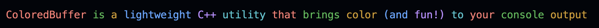
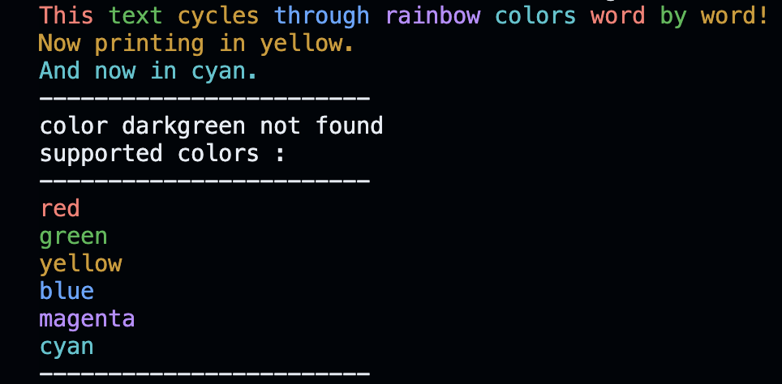

It works by overriding std::streambuf to intercept what you print to std::cout and decorate it with ANSI escape codes for colored text\n";
## Features

- **Rainbow Mode**: Automatically cycles through colors for each space-separated word
- **Specific Colors**: Set output to any supported color by name
- **Automatic Reset**: Colors automatically reset when the object is destroyed
- **Safe Wrapper**: Includes a RAII wrapper for safe usage

## Installation

Simply include the header file in your C++ project:

```cpp
#include "ColoredBuffer.hpp"  // or copy the code directly into your file
// Create ColoredBuffer instance and wrapper
ColoredBuffer rb(std::cout.rdbuf());
wrapper guard(rb);  // RAII wrapper for safety
// Now all std::cout output will be colored!
```
## Available Methods
```cpp
// Enable rainbow cycling (changes color on each space)
rb.rainbow();

// Set a specific color by name
rb.set_color("blue");
rb.set_color("green");

// Disable coloring (resets to default)
rb.disable();

// Show available colors
rb.check_avaiable_colors();

```
## Example Program

```cpp

#include <iostream>
#include "ColoredBuffer.hpp"

int main() {
    ColoredBuffer rb(std::cout.rdbuf());
    wrapper guard(rb);  // RAII guard to restore std::cout

    rb.rainbow();
    std::cout << "This text cycles through rainbow colors word by word!\n";
    rb.disable();

    rb.set_color("yellow");
    std::cout << "Now printing in yellow.\n";

    rb.set_color("cyan");
    std::cout << "And now in cyan.\n";

    rb.set_color("darkgreen"); // not supported → shows available colors
}
```
## Output


## Supported Colors

- **red**
- **green**
- **yellow**
- **blue**
- **magenta**
- **cyan**

You can easily add more colors by extending the colors vector with new Color entries by just adding a name as well its corresponding ANSI Color Code